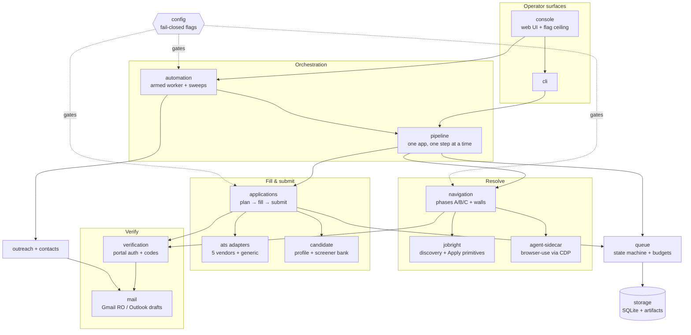

# Dispatch codebase knowledge graph

Agent-first map of this codebase. **`graph.json` is the machine-readable
source of truth** (nodes = subsystems, edges = dependencies, plus the flag
registry and invariants). This file is the human/agent narrative on top.

**It cannot rot:** `tests/unit/knowledge-graph.test.ts` validates every
claim on every `npm run test` — files exist, exported symbols exist, edges
reference real nodes, every top-level `src/` directory is owned by exactly
one node, and every listed flag exists in the env schema. If you add a
subsystem or rename an export, the gate fails until the graph is updated.

## The system in one paragraph

Dispatch turns a JobRight posting into a verified job application with no
human in the loop while an operator has ARMED a session. Jobs enter via
**discovery** (`jobright`), get their real employer URL resolved by
**navigation** (deterministic phases, then a browser-use **agent**), are
filled and submitted by the **applications** engine through per-vendor
**ATS adapters** (plus a generic adapter for any https employer form),
with **verification** handling portal sign-in and emailed codes, and an
**outreach** tail drafting (never sending) referral emails. Everything
moves through the **queue** state machine in SQLite; **pipeline** steps
one app, the **automation** worker loops many under an armed budget; the
**console** and **CLI** are the operator surfaces. Every mutation sits
behind a fail-closed flag in **config**.

## Subsystem map



## The application lifecycle (happy path)

```
DISCOVERED → QUEUED → MATERIALS_GENERATING → RESUME_DOWNLOADED
  → APPLICATION_OPENING   (navigation resolves the employer URL)
  → ATS_DETECTION         (detectAtsFromUrl: vendor first, generic last)
  → inspection → fill     (runAtsLiveFill: gate → portal auth → plan → fill → verify → upload)
  → READY_TO_SUBMIT → SUBMITTING → SUBMITTED → outreach tail → COMPLETED
```

Full edges: `docs/state-machine.md`. Parks: `AUTH_REQUIRED`,
`CAPTCHA_REQUIRED`, `UNSUPPORTED_ATS`, `FAILED_RETRYABLE`, review items.
Armed sessions run sweeps that un-park what has become fillable
(`src/automation/navRequeue.ts`).

## Where to look when… (playbooks)

| Symptom / task | Start here |
|---|---|
| App stuck, why? | `application_events` table (reasons) + `review_items`; `npm run report` |
| Fill parked "employer URL missing" | Fill with no stored URL + `NAVIGATION_ENABLED` returns to `APPLICATION_OPENING` (`runPipeline` NATIVE_AUTOFILL case). Leftover missing-URL reviews do not halt that recovery. |
| Fill refused URL vs `Unknown company (manual enqueue)` | Placeholder company names are uncheckable (`checkUrlCongruence` → `unknown`, not `mismatch`). Pipeline start clears leftover "URL belongs to" reviews when identity is no longer a mismatch. |
| `wall: agent_unavailable` | CDP Chrome not on :9222 — start it or grant `CDP_AUTOLAUNCH_ENABLED` |
| Fill planned 0 fields | `artifacts/ats-fill/**` report: `gate` (NO_APPLICATION_FORM = posting page, not form), `plan_fields`, `form_snapshot_path` |
| Workday weirdness | `classifyWorkdayPage` notes in the fill report ("page kind at gate/after auth"); portal auth walk notes |
| Submit refused | `submit-run-*.json` `reason`: unanswered required questions, disabled control diagnosis, confirmation transport |
| Wrong/duplicate employer URL | `congruence` block on the nav report (evidence only); `auditEmployerUrls` for repairs |
| A screener answered wrong | `src/candidate/screenerMatch.ts` resolution tiers; plan entry `reason` names the basis |
| Add an ATS vendor | Copy `src/ats/workable/` shape: urlValidation + selectors + v1 + submission; register in `atsBindings.ts` + `urlValidationDispatch.ts`; adapter contract in `src/ats/adapter.ts` |
| Add a capability flag | `src/config/env.ts` + `flagCeiling.ts` + `fillEnvIsolation.ts` + CLAUDE.md **and** `.cursor/rules/house-rules.mdc` (keep identical) + `.env.example` |
| Change CLI behavior | Update `docs/operator-guide.md` in the same commit (operator contract) |
| What may I never do? | `graph.json` → `invariants`; CLAUDE.md safety section |

## Trust model (why the gates are where they are)

Provenance, not allowlists: every URL the system fills was resolved from a
JobRight posting the operator queued, via the posting's own Apply path.
Hostname-vs-company congruence is **recorded evidence, never a gate**
(operator directive 2026-08-14). What still refuses, everywhere:

- URL shape: non-https, jobright.ai, malformed vendor URLs.
- Page shape: login wall / CAPTCHA / zero fillable fields (pre-mutation gate).
- Values: only the approved plan; demographics only from the encrypted
  sensitive profile; screener options matched verbatim to the page.
- The click: `SUBMIT_ENABLED` + approved entry + idempotency + operator
  confirmation **or** an armed session's atomic budget.
- Mail: drafts only — sending is banned at the identifier level
  (`check:forbidden`).

## Verification & artifacts

- Verify gate (run before every commit):
  `npm run typecheck && npm run test && npm run check:forbidden && npm run check:secrets`
- Validation ladder (`docs/validation-levels.md`): UNIT → FIXTURE →
  LIVE_READ_ONLY → LIVE_MUTATION; self-reports carry no level.
- Artifacts: `artifacts/navigation/` (nav reports), `artifacts/ats-fill/`
  (fill/refusal reports), `artifacts/applications/<id>/submission/`
  (submit runs), `artifacts/console/runs/<id>/` (armed-session logs +
  granted flags), `artifacts/discovery/`. The improvement loop reads these
  after each `ARTIFACT_AUTOPUSH_ENABLED` push.

## Reading order for a new agent

1. This file, then `graph.json` (nodes → edges → flags → invariants).
2. CLAUDE.md (house rules — binding), `docs/state-machine.md`.
3. The subsystem you're touching: its `key_files` in `graph.json`.
4. The newest artifacts for live behavior — they outrank any doc.
